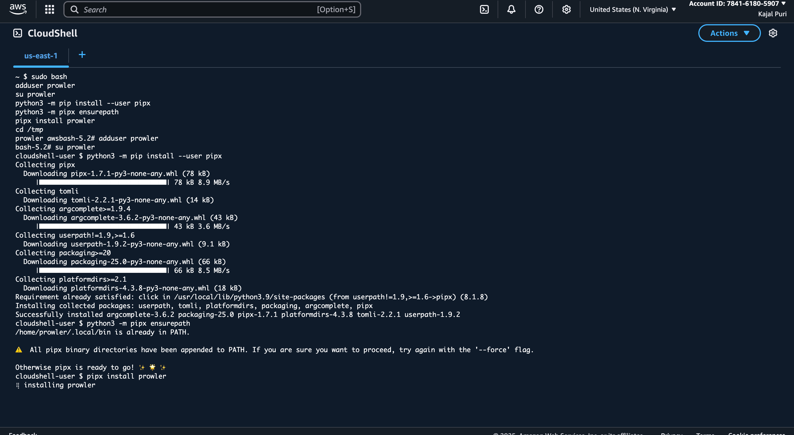
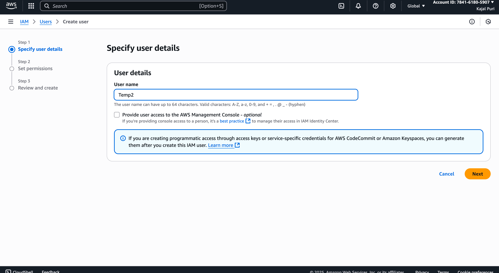
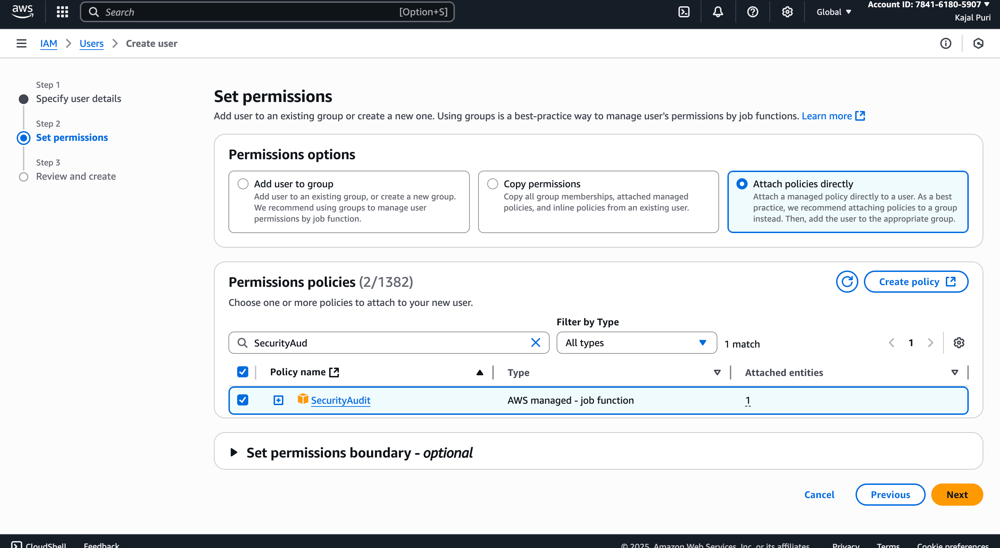
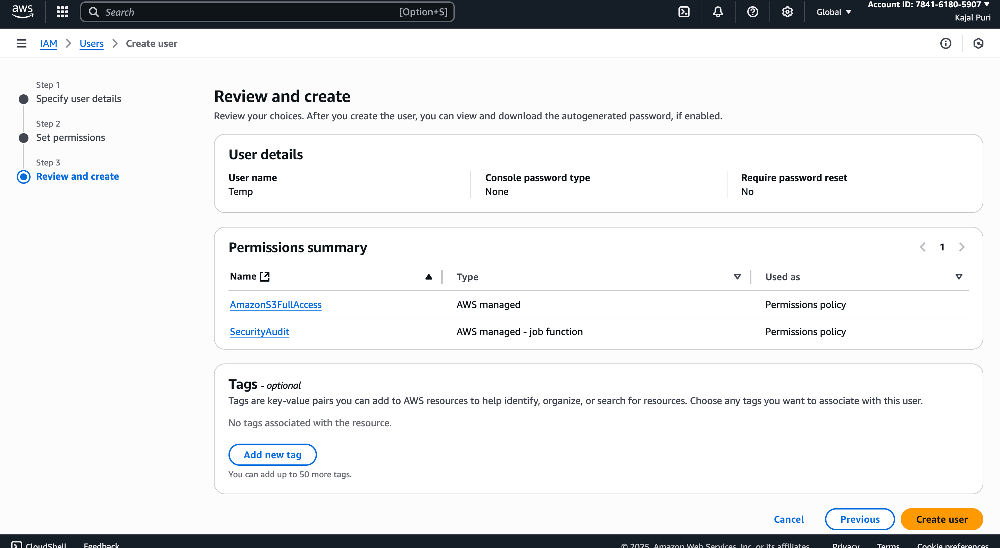

<h2> Description </h2>
This projects demonstrates how the audit scan can be automated using AWS Prowler. Prowler is an open source security tool, used to assess security posture in cloud environment

<h2> Part 1: Install Prowler in AWS </h2>
Navigate to Cloud shell in AWS by typing 'Cloud Shell' in search bar. After that, install prowler in AWS. Here is the prowler documentation: https://docs.prowler.com/projects/prowler-open-source/en/latest/#__tabbed_2_8. 
The command to install prowler is: 
```
sudo bash
adduser prowler
su prowler
python3 -m pip install --user pipx
python3 -m pipx ensurepath
pipx install prowler
cd /tmp
prowler aws


```bash
sudo bash
adduser prowler
su prowler
python3 -m pip install --user pipx
python3 -m pipx ensurepath
pipx install prowler
cd /tmp
prowler aws
```



<h2> Part 2: Create a User in IAM </h2>
Navigate to IAM and then to users. Create user by selecting attach policies option


Give s3 full access and security audit permission to the user


<h2> Part 3: Configure AWS to Scan Using User Credentials </h2>


<h2> Part 4: Use Prowler Compliance </h2>

<h2> Part 5: Create S3 Bucket for Output Storage </h2>


 <h2> References </h2>
 https://medium.com/@Kajal0/automating-audit-in-aws-using-prowler-7afb14433ac5
 
