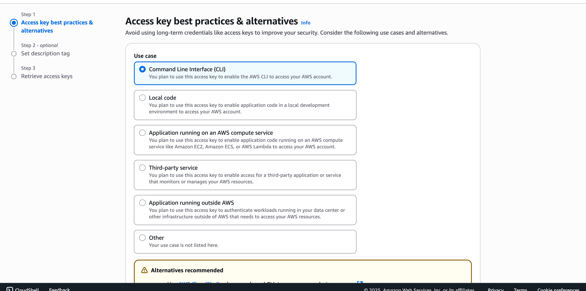
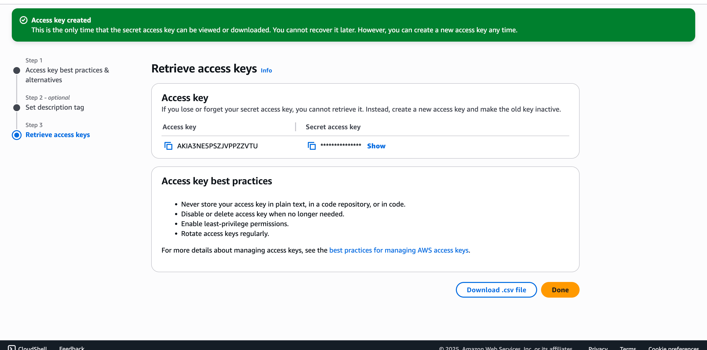
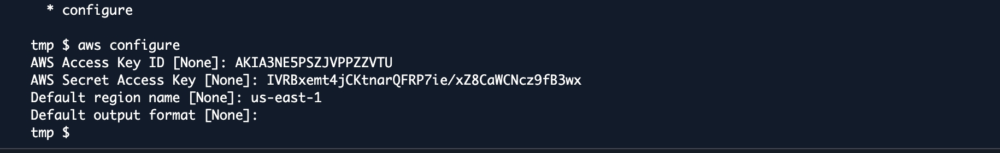
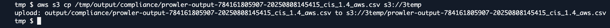
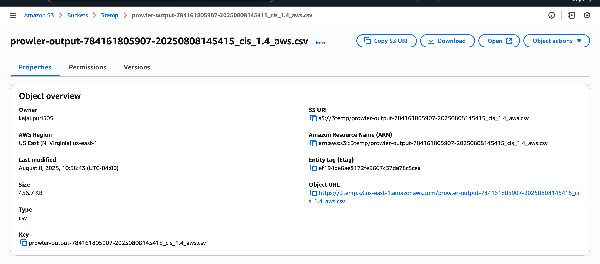

<h2> Description </h2>
This projects demonstrates how the audit scan can be automated using AWS Prowler. Prowler is an open source security tool, used to assess security posture in cloud environment

<h2> Part 1: Install Prowler in AWS </h2>
Navigate to Cloud shell in AWS by typing 'Cloud Shell' in search bar. After that, install prowler in AWS. Here is the prowler documentation: https://docs.prowler.com/projects/prowler-open-source/en/latest/#__tabbed_2_8. 
The command to install prowler is: 

```bash
sudo bash
adduser prowler
su prowler
python3 -m pip install --user pipx
python3 -m pipx ensurepath
pipx install prowler
cd /tmp
prowler aws
```


<h2> Part 2: Create a User in IAM </h2>
Navigate to IAM and then to users. Create user by selecting attach policies option


Give s3 full access and security audit permission to the user


<h2> Part 3: Configure AWS to Scan Using User Credentials </h2>
Check the prowler version using command <B>prowler -v</B>. This proofs that prowler is installed in your environment. After that, configure AWS to scan using command <B>aws configure</B>. Grab credentials of user that you have created in previous step. In my case, it is temp2. Navigate to 'create access key', then choose option command line interface

After that access key will be created with Access Key ID and Secret Access Key.

Then, configure aws using these credentials for scan.


<h2> Part 4: Use Prowler Compliance </h2>
Here, <B>prowler aws --list-compliance</B> gives the list of all the compliance. Prowler Compliance documentation is linked here: https://docs.prowler.com/projects/prowler-open-source/en/latest/tutorials/compliance/

Here, I used cis_1.4 framework to scan the system. Use the command: <B>prowler aws --compliance cis_1.4_aws</B>


<h2> Part 5: Create S3 Bucket for Output Storage </h2>
After that create a s3 bucket with all default credentials to store output. In my case, the s3 bucket is: <B>3temp</B>
We must copy the result to s3 and download the csv file: <B>aws s3 cp /tmp/output/compliance/prowler-output-784161805907-20250808145415_cis_1.4_aws.csv s3://3temp</B>

This gives the name of the location in s3 bucket. In my case, it is: prowler-output-784161805907-20250808145415_cis_1.4_aws.csv
 The file is stored in s3 bucket.
 
 Then after downloading the file from the storage, we receive csv with all the details.
 
 <h2> References </h2>
 https://medium.com/@Kajal0/automating-audit-in-aws-using-prowler-7afb14433ac5
 
